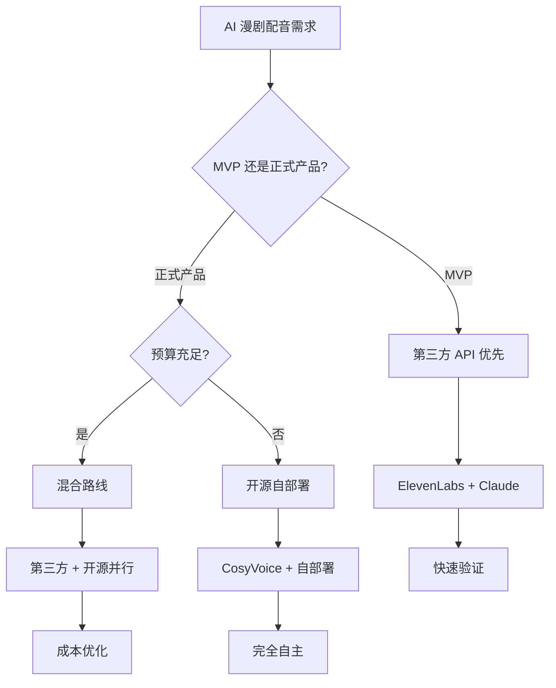
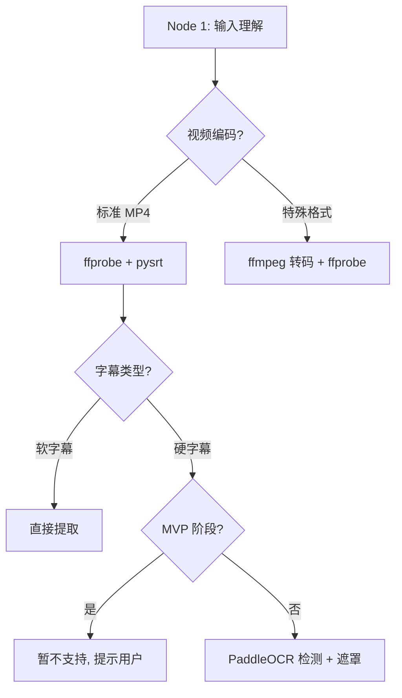
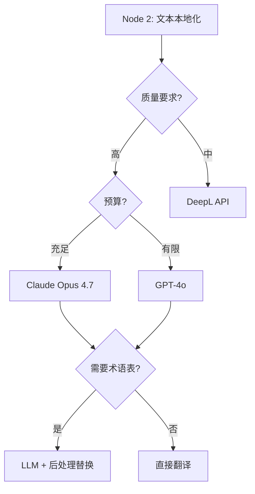
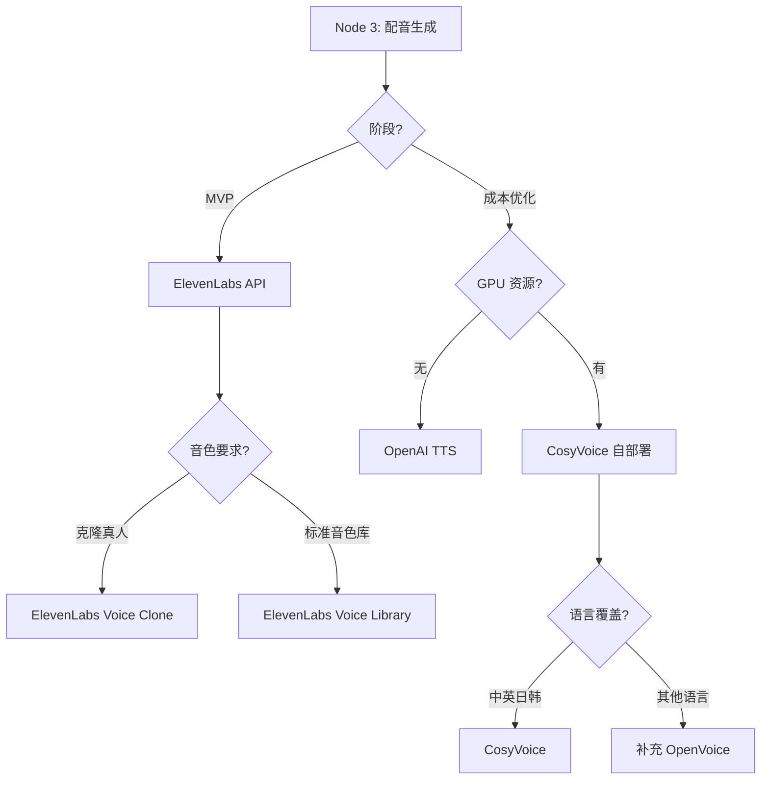
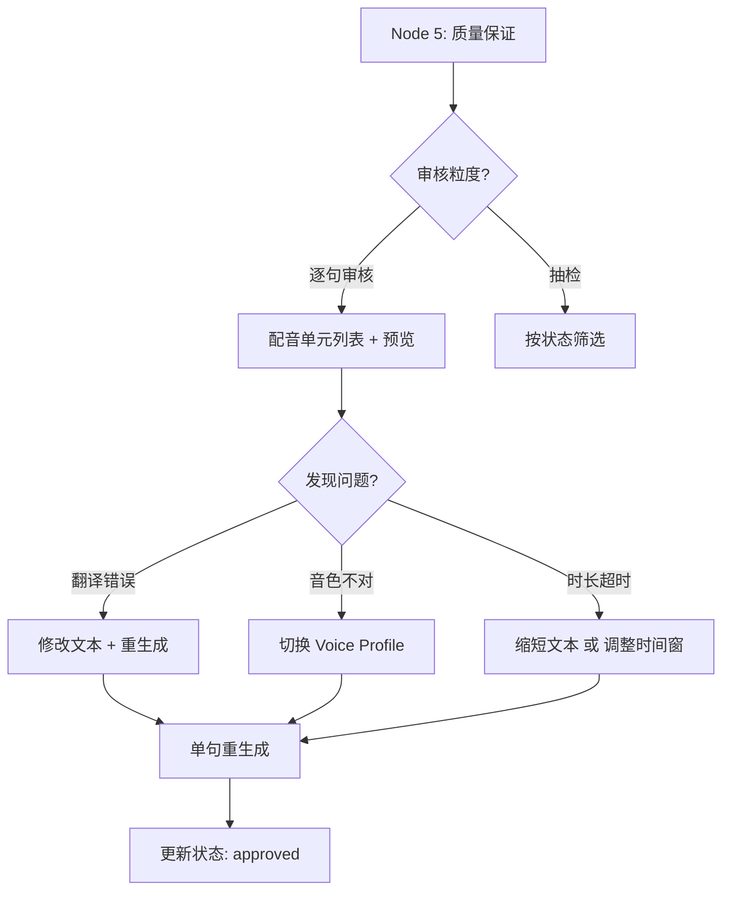

# AI 漫剧配音本地化 - 决策框架

> **文档定位**: 技术选型决策指南，什么场景选什么方案
>
> **目标读者**: 技术负责人、架构师、项目经理
>
> **核心问题**: Build vs Buy? 用哪个供应商? 开源还是第三方?

---

## 一、核心决策流程



---

## 二、Build vs Buy 决策矩阵

### 2.1 决策维度

| 能力模块 | 成熟度 | 差异化价值 | 成本敏感度 | 决策 | 推荐方案 |
|----------|--------|-----------|------------|------|----------|
| **视频解析** | 高 | 低 | 低 | **Buy** | ffmpeg (开源, 事实标准) |
| **字幕解析** | 高 | 低 | 低 | **Buy** | pysrt (开源库) |
| **翻译** | 高 | 中 | 中 | **Buy** | Claude Opus 4.7 API |
| **TTS** | 中 | 高 | 高 | **Buy + 评测开源** | ElevenLabs (MVP) + CosyVoice (备选) |
| **音源分离** | 中 | 中 | 低 | **Buy** | Demucs (开源, Meta) |
| **音视频合成** | 高 | 低 | 低 | **Buy** | ffmpeg |
| **审核工作台** | 低 | 高 | - | **Build** | 自研 Web UI |
| **任务编排** | 中 | 中 | - | **Build** | FastAPI + Celery |

**决策规则**:
- **成熟度高 + 差异化低** → Buy (如 ffmpeg)
- **成熟度高 + 差异化高 + 成本敏感** → Buy + 评测开源 (如 TTS)
- **成熟度低 + 差异化高** → Build (如审核工作台)

---

### 2.2 Build vs Buy 成本对比

| 模块 | Buy 成本 | Build 成本 | 时间成本 | 推荐 |
|------|----------|-----------|----------|------|
| **TTS** | $1.35/集 (ElevenLabs) | 开发 4 人周 + GPU $500/月 | 4 周 | Buy (MVP), 后期评测开源 |
| **翻译** | $0.51/集 (Claude) | 开发 2 人周 + 训练数据 | 4 周 | Buy |
| **审核工作台** | SaaS $50/月/用户 (不适配) | 开发 2 人周 | 2 周 | Build |
| **音源分离** | API $0.1/分钟 (少) | Demucs (开源) | 1 周集成 | Buy (开源) |

---

## 三、技术路线对比

### 3.1 三条主路线

| 路线 | 方案 | 成本 | 质量 | 风险 | 推荐度 | 适用场景 |
|------|------|------|------|------|--------|----------|
| **全第三方** | ElevenLabs + Claude + ffmpeg | 高 ($2/集) | 高 | 供应商锁定 | ⭐⭐⭐ | MVP 快速验证 |
| **混合路线** | 第三方 (MVP) + 开源 (并行评测) | 中 ($1/集) | 中-高 | 技术复杂度 | ⭐⭐⭐⭐⭐ | **推荐** |
| **全开源** | CosyVoice + 自部署 | 低 (GPU 成本) | 中 | 质量不稳定 | ⭐⭐ | 成本极度敏感 |

---

### 3.2 混合路线详解 (推荐)

**核心思路**: MVP 用第三方快速验证, 并行评测开源方案, 逐步替换高成本模块

```text
阶段 1 (MVP, Week 1-4):
├── 翻译: Claude Opus 4.7 API
├── TTS: ElevenLabs API
├── 视频处理: ffmpeg
└── 目标: 跑通端到端, 验证质量

阶段 2 (并行评测, Week 5-8):
├── 翻译: Claude (主) + DeepL (备)
├── TTS: ElevenLabs (主) + CosyVoice (评测)
├── 音源分离: Demucs (开源)
└── 目标: 成本优化, 供应商备份

阶段 3 (成本优化, Week 9-12):
├── 翻译: Claude (高质量) + DeepL (批量)
├── TTS: ElevenLabs (高质量) + CosyVoice (批量)
├── 目标: 成本降低 50%

阶段 4 (自主可控, 3 个月后):
├── 根据数据决定是否自研/微调
└── 只对真实瓶颈做深度优化
```

---

## 四、5 节点方案决策树

### Node 1: 输入理解 (Ingest & Parse)

**核心问题**: 能否正确解析视频、字幕、语言?



**推荐方案**:
- ✅ ffprobe (视频元信息)
- ✅ pysrt (SRT 解析)
- ⚠️ 硬字幕检测: MVP 暂不支持, V1 再做

---

### Node 2: 文本本地化 (Localization)

**核心问题**: 翻译质量是否可接受?



**推荐方案**:
| 场景 | 推荐方案 | 单集成本 | 质量 |
|------|----------|----------|------|
| **高质量 (推荐)** | Claude Opus 4.7 | $0.51 | ⭐⭐⭐⭐⭐ |
| 成本优先 | DeepL API | $0.30 | ⭐⭐⭐⭐ |
| 平衡 | GPT-4o | $0.20 | ⭐⭐⭐⭐ |

---

### Node 3: 配音生成 (Voice Generation)

**核心问题**: 音色是否接近? 时长是否可控?



**推荐方案**:
| 场景 | 推荐方案 | 单集成本 | 质量 | 部署复杂度 |
|------|----------|----------|------|------------|
| **MVP (推荐)** | ElevenLabs API | $1.35 | ⭐⭐⭐⭐⭐ | 无 (API) |
| 成本优化 | CosyVoice | GPU $0.50 | ⭐⭐⭐⭐ | 中 (Docker) |
| 快速备选 | OpenAI TTS | $0.15 | ⭐⭐⭐ | 无 (API) |
| 开源探索 | OpenVoice | GPU $0.50 | ⭐⭐⭐ | 高 (需训练) |

---

### Node 4: 音视频合成 (Media Composition)

**核心问题**: 混音、字幕渲染是否正常?

```mermaid
graph TD
    A[Node 4: 音视频合成] --> B{需要保留背景音?}
    B -->|是| C{MVP 阶段?}
    B -->|否| D[直接替换音轨]
    
    C -->|是| E[简单混音 (降低原音)]
    C -->|否| F[音源分离]
    
    F --> G[Demucs 分离]
    G --> H[保留 Music Stem]
    
    D --> I{字幕类型?}
    E --> I
    H --> I
    
    I -->|软字幕| J[ffmpeg 嵌入]
    I -->|硬字幕| K[遮罩 + 渲染]
```

**推荐方案**:
| 能力 | MVP 方案 | V1 方案 | 工具 |
|------|----------|---------|------|
| **混音** | 降低原音 -12dB + 叠加配音 | Demucs 分离 + Stem 混音 | ffmpeg / Demucs |
| **字幕** | 软字幕嵌入 | 硬字幕遮罩 + ASS 渲染 | ffmpeg / libass |
| **导出** | MP4 (H.264) | MP4 + 独立 SRT/音轨 | ffmpeg |

---

### Node 5: 质量保证 (QA & Iteration)

**核心问题**: 人工能否快速审核、修正、重生成?



**推荐方案**:
| 功能 | MVP 实现 | 优先级 |
|------|----------|--------|
| **配音单元列表** | 表格展示 (start_time, text, status) | P0 |
| **单句预览** | 点击播放单条音频 | P0 |
| **文本编辑** | 修改 target_text → 重生成 | P0 |
| **状态筛选** | 按 overflow / failed / pending 筛选 | P1 |
| **批量操作** | 批量重生成、批量审核 | P1 |
| **A/B 对比** | 对比不同 provider 生成结果 | P2 (V1) |

---

## 五、供应商选择决策

### 5.1 TTS 供应商对比

| 供应商 | 音色克隆 | 多语言 | 情绪控制 | 价格 | 质量 | API 稳定性 | 推荐度 |
|--------|----------|--------|----------|------|------|-----------|--------|
| **ElevenLabs** | ⭐⭐⭐⭐⭐ | 29 种 | ⭐⭐⭐⭐ | $0.30/1K | ⭐⭐⭐⭐⭐ | 高 | ⭐⭐⭐⭐⭐ MVP 首选 |
| OpenAI TTS | ⭐⭐ | 支持 | ⭐⭐ | $0.015/1K | ⭐⭐⭐ | 高 | ⭐⭐⭐⭐ 性价比备选 |
| Azure TTS | ⭐⭐⭐ | 100+ | ⭐⭐⭐ | $16/1M | ⭐⭐⭐⭐ | 极高 | ⭐⭐⭐⭐ 企业级 |
| Google TTS | ⭐⭐ | 40+ | ⭐⭐ | $16/1M | ⭐⭐⭐ | 高 | ⭐⭐⭐ 备选 |
| CosyVoice (开源) | ⭐⭐⭐⭐ | 中英日韩 | ⭐⭐⭐ | GPU 成本 | ⭐⭐⭐⭐ | 自部署 | ⭐⭐⭐⭐ 成本优化 |

**决策建议**:
- **MVP**: ElevenLabs (质量最高, 快速验证)
- **备选**: OpenAI TTS (性价比高, API 稳定)
- **成本优化**: CosyVoice (开源, 需 GPU)

---

### 5.2 翻译供应商对比

| 供应商 | 质量 | 上下文理解 | 术语表支持 | 价格 | API 稳定性 | 推荐度 |
|--------|------|-----------|-----------|------|-----------|--------|
| **Claude Opus 4.7** | ⭐⭐⭐⭐⭐ | ⭐⭐⭐⭐⭐ | Prompt 注入 | $0.075/1K | 高 | ⭐⭐⭐⭐⭐ 推荐 |
| GPT-4o | ⭐⭐⭐⭐⭐ | ⭐⭐⭐⭐⭐ | Prompt 注入 | $0.01/1K | 高 | ⭐⭐⭐⭐ 性价比 |
| DeepL API | ⭐⭐⭐⭐ | ⭐⭐⭐ | 术语表 API | $0.02/1K | 极高 | ⭐⭐⭐⭐ 批量翻译 |
| Google Translate | ⭐⭐⭐ | ⭐⭐ | 术语表 | $0.02/1K | 高 | ⭐⭐⭐ 备选 |

**决策建议**:
- **高质量 (推荐)**: Claude Opus 4.7 (上下文理解最好)
- **成本优先**: DeepL API (翻译质量好, 价格低)
- **平衡**: GPT-4o (质量高, 性价比好)

---

### 5.3 开源方案对比

| 项目 | GitHub Star | 维护状态 | 部署难度 | 质量 | 推荐度 | 适用场景 |
|------|-------------|----------|----------|------|--------|----------|
| **CosyVoice** | 12k+ | 活跃 | 中 | ⭐⭐⭐⭐ | ⭐⭐⭐⭐⭐ | TTS (中英日韩) |
| OpenVoice | 30k+ | 活跃 | 中 | ⭐⭐⭐ | ⭐⭐⭐⭐ | TTS (跨语言音色克隆) |
| Demucs | 8k+ | 活跃 | 低 | ⭐⭐⭐⭐⭐ | ⭐⭐⭐⭐⭐ | 音源分离 |
| WhisperX | 10k+ | 活跃 | 中 | ⭐⭐⭐⭐⭐ | ⭐⭐⭐⭐ | ASR + 说话人识别 |
| GPT-SoVITS | 40k+ | 活跃 | 高 | ⭐⭐⭐⭐ | ⭐⭐⭐ | Few-shot TTS (需微调) |

**决策建议**:
- **TTS**: CosyVoice (成熟, 多语言)
- **音源分离**: Demucs (Meta 出品, 质量高)
- **ASR**: WhisperX (可选, 辅助对齐)

---

## 六、决策检查清单

### 6.1 MVP 阶段决策清单

在启动 MVP 开发前, 确认以下决策:

| 决策项 | 推荐方案 | 确认状态 |
|--------|----------|----------|
| **翻译 Provider** | Claude Opus 4.7 | ☐ |
| **TTS Provider** | ElevenLabs | ☐ |
| **备用 TTS** | OpenAI TTS 或 CosyVoice | ☐ |
| **音源分离** | Demucs (可选, V1 再做) | ☐ |
| **视频处理** | ffmpeg | ☐ |
| **后端框架** | FastAPI + Celery | ☐ |
| **前端框架** | React (轻量 UI) | ☐ |
| **存储** | MinIO / S3 | ☐ |
| **数据库** | PostgreSQL | ☐ |

---

### 6.2 成本优化决策清单

当运营成本超过预期时, 按优先级评估:

| 优化项 | 预期节省 | 实施难度 | 优先级 |
|--------|----------|----------|--------|
| **切换到 DeepL 翻译** | 60% | 低 | P1 |
| **部分场景用 OpenAI TTS** | 50% | 低 | P1 |
| **评测并切换到 CosyVoice** | 70% | 中 | P2 |
| **批量处理降低单价** | 20% | 低 | P1 |
| **优化 Prompt 减少 token** | 10% | 低 | P2 |

---

### 6.3 质量不达标决策清单

当质量评分 <4.0/5 时, 按优先级排查:

| 问题类型 | 排查方向 | 缓解措施 |
|----------|----------|----------|
| **翻译不准确** | 术语表、上下文 | 增加术语表, 调整 Prompt |
| **音色不相似** | Voice Profile 配置 | 重新克隆, 调整参考音频 |
| **时长超时** | 文本过长 | 缩短文本, 调整语速 |
| **音质失真** | Time-stretch 过度 | 放宽时间窗, 减少压缩 |
| **背景音丢失** | 未做音源分离 | 启用 Demucs 分离 |

---

## 七、决策更新机制

### 7.1 何时重新评估决策?

| 触发条件 | 重新评估内容 |
|----------|--------------|
| **API 价格变化 >30%** | 重新对比 Provider 成本 |
| **质量评分连续 3 集 <4.0** | 重新评估 Provider 质量 |
| **处理集数 >500** | 评估是否切换到开源方案 |
| **新 Provider 上线** | 评测并对比现有方案 |
| **监管政策变化** | 评估合规风险, 调整方案 |

---

### 7.2 决策评审周期

| 阶段 | 评审周期 | 评审内容 |
|------|----------|----------|
| **MVP (前 100 集)** | 每 10 集 | 成本、质量、风险 |
| **成长期 (100-500 集)** | 每 50 集 | 成本优化、Provider 备份 |
| **成熟期 (500+ 集)** | 每季度 | 战略方向、自研评估 |

---

## 八、快速决策参考

### 8.1 场景化决策表

| 场景 | 翻译 | TTS | 音源分离 | 总成本/集 |
|------|------|-----|----------|-----------|
| **MVP 快速验证** | Claude | ElevenLabs | 无 (简单混音) | $1.92 |
| **质量优先** | Claude | ElevenLabs | Demucs | $2.50 |
| **成本优先** | DeepL | OpenAI TTS | 无 | $0.50 |
| **平衡 (推荐)** | Claude | ElevenLabs (主) + OpenAI (备) | Demucs | $1.50 |

---

### 8.2 一句话决策

**如果只能记住一条决策原则**:

> MVP 用第三方 API 快速验证质量和成本, 并行评测开源方案作为备份, 只对真实瓶颈做自研。

---

**文档版本**: 1.0  
**最后更新**: 2026-06-03  
**维护者**: 王桥  
**下一次评审**: MVP 完成后
