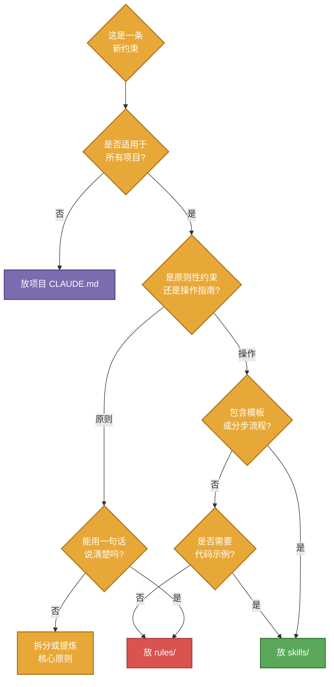

# rule 与 skill 的职责边界

> **文档职责**：明确 rules/ 和 skills/ 两个目录的职责定位、边界划分和协作关系
> **适用场景**：新增规范约束时判断该放 rule 还是 skill；发现重复或冲突时用于仲裁
> **目标读者**：维护本项目规范体系的开发者
> **维护规范**：每次调整 rule 或 skill 的组织方式时，必须同步更新本文档

---

## 核心区别

| 维度 | rules/ | skills/ |
|------|--------|---------|
| **性质** | 原则性约束 | 操作性指南 |
| **回答问题** | 要做什么 / 不能做什么 | 怎么做 / 用什么模板 |
| **表达方式** | 简洁的规则列表 | 分章节的工作流 + 模板 |
| **包含内容** | 禁止项、必须项、判断标准 | 模板代码、检查清单、示例 |
| **加载时机** | 全局默认加载（通过 CLAUDE.md） | 按需加载（触发场景匹配时） |
| **典型长度** | 10-30 行 | 50-200 行 |

---

## 职责定位

### rules/ 的职责

**定位**：跨项目通用的最小约束集，说"红线在哪里"。

**适合放这里的**：
- 分层架构禁止项（入口层不能直接操作数据库）
- 代码风格硬性要求（只写 WHY 注释）
- 文档表达原则（先结论后展开）
- 命名规范的核心原则

**不适合放这里的**：
- 具体的代码模板
- 分步骤的操作流程
- 多种场景的示例代码
- 工具使用的详细指南

**示例**（rules/writing.md）：
```markdown
- 先结论后展开，先全貌后细节，避免重复和空话
- 只写 WHY 注释，不写 WHAT；语言简洁、直接、可执行
- 图示用 Mermaid（配色使用 classDef，深色背景配白色文字）
```

### skills/ 的职责

**定位**：特定任务类型的完整操作手册，说"具体怎么干"。

**适合放这里的**：
- 文档模板（开头结构、章节组织）
- 工作流程（新建 → 填充 → 检查）
- 代码示例（配色方案、函数结构）
- 检查清单（Review 时对照的要点）

**不适合放这里的**：
- 跨任务的通用原则（应该放 rules）
- 项目特定的约束（应该放项目 CLAUDE.md）
- 一次性的决策记录（应该放 drafts）

**示例**（skills/writing/SKILL.md）：
```markdown
## §1 最小模板

每份文档开头结构固定：

​```markdown
# 文档标题
> **文档职责**：...
​```

## §4 Mermaid 配色最佳实践

​```mermaid
classDef planning fill:#4A90D9,stroke:#2C5F8A,stroke-width:2px,color:#fff
​```
```

---

## 边界判断标准

遇到一条新约束时，按以下标准判断归属：



**快速判断口诀**：
- 一句话能说清 → rules
- 需要代码模板 → skills
- 需要分步流程 → skills
- 只在某个项目适用 → 项目 CLAUDE.md

---

## 协作关系

### 1. rule 指向 skill

rule 说原则，skill 提供实现方法。

**示例**：
- rules/writing.md：`图示用 Mermaid（配色使用 classDef）` ← 原则
- skills/writing/SKILL.md：`## §4 Mermaid 配色最佳实践 + 具体代码模板` ← 方法

### 2. skill 依赖 rule

skill 开头声明遵守哪些 rule。

**示例**（skills/writing/SKILL.md）：
```markdown
填充内容时遵循 `rules/writing.md`
```

### 3. 互不重复

**反例**（应避免）：
```markdown
# rules/writing.md
- 文档开头必须有标题和职责说明

# skills/writing/SKILL.md
## §1 最小模板
每份文档开头结构固定：先一级标题，再引用块
```
→ 冲突：rule 和 skill 都在说"文档开头结构"

**正确做法**：
- rule 只说"要有职责说明"（原则）
- skill 说"职责说明的具体格式和字段"（模板）

---

## 当前状态检查

### 已有 rules
- ✅ `writing.md`：文档表达原则（先结论后展开、WHY 注释、图示规范）

### 已有 skills
- ✅ `writing`：文档写作模板和流程
- ✅ `design-doc`：设计文档写作指南
- ✅ `code-explain`：代码讲解文档指南
- ✅ `fastapi-backend`：FastAPI 后端项目规范
- ✅ `python-script`：批量脚本规范
- ✅ `python-ops-cli`：运维 CLI 工具规范
- ✅ `shell-service`：服务管理脚本规范
- ✅ `os-maintenance`：模具维护指南

### 协调检查
- ✅ rules/writing.md 和 skills/writing 无冲突
  - rule：说原则（先结论后展开、Mermaid 用 classDef）
  - skill：提供模板（文档开头结构、Mermaid 配色代码）
- ✅ 所有 skill 都在 CLAUDE.md 中有明确触发场景
- ✅ rules 通过 CLAUDE.md 全局加载

---

## 扩展指南

### 何时新增 rule

**条件**（同时满足）：
1. 跨所有项目通用
2. 违反会导致明显问题
3. 可以用一句话表达清楚

**流程**：
1. 判断是否已有相关 rule 可以扩展
2. 如无，在对应 rules/*.md 中新增一行
3. 更新对应 skill 的引用（如有）

### 何时新增 skill

**条件**（满足其一）：
1. 新增了一类任务类型（如新增"API 设计"类任务）
2. 现有任务需要标准化模板和流程
3. 发现团队反复在某个任务上出错

**流程**：
1. 在 skills/ 下新建目录 `<skill-name>/SKILL.md`
2. 使用 frontmatter 定义 name、description、触发词
3. 组织章节：最小模板 → 工作流 → 检查点 → 适用场景
4. 在 CLAUDE.md 的 skill 指针表中注册

---

## 反模式警示

### ❌ 反模式 1：rule 写得太细

**错误**：
```markdown
# rules/writing.md
- 文档开头必须有 `> **文档职责**：` 字段
```

**问题**：这是模板细节，应该在 skill 里。

**正确**：
```markdown
# rules/writing.md
- 文档开头必须说明职责和适用场景
```

### ❌ 反模式 2：skill 重复 rule

**错误**：
```markdown
# skills/writing/SKILL.md
## 表达原则
- 先结论后展开
- 只写 WHY 注释
```

**问题**：重复了 rules/writing.md 的内容。

**正确**：
```markdown
# skills/writing/SKILL.md
填充内容时遵循 `rules/writing.md`
```

### ❌ 反模式 3：skill 当 rule 用

**错误**：把通用原则塞进某个 skill，其他 skill 看不到。

**正确**：通用原则提升到 rules/，让所有 skill 都能引用。

---

## 维护检查清单

每次修改 rules 或 skills 后，检查：

- [ ] rule 和 skill 之间没有内容重复
- [ ] rule 中的原则在对应 skill 中有实现方法
- [ ] skill 中引用的 rule 路径正确
- [ ] CLAUDE.md 中的 skill 指针表已更新
- [ ] 本文档的"当前状态检查"已同步
