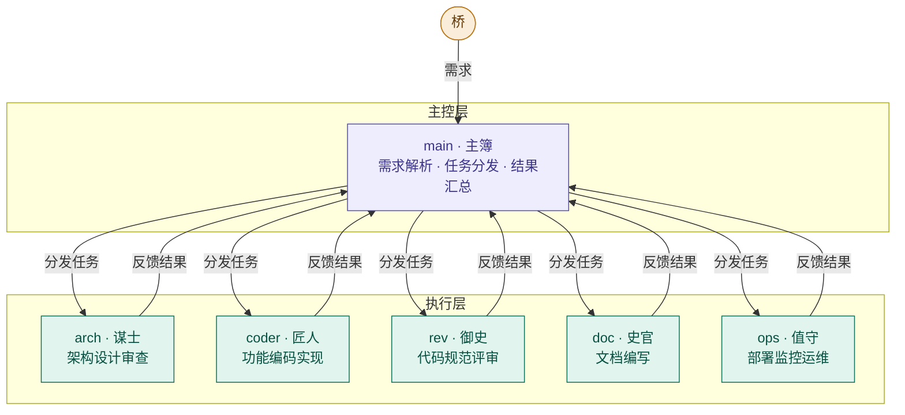

你的真实述求我理解了。不是"我要 5 个 agent 协作"，而是：

**如何让这套模具本身可维护、可迭代、不因规则增多而失控。**

让我先搞清楚一个关键事实再给建议。现在有了足够的事实依据。来给你一个清晰的分析和推荐方案。

---



## 先对齐一个关键事实

CLAUDE.md 是始终加载的。skill 是按需加载的。正因如此，50 个 skill 不会拖慢 Claude，但一个 5000 行的 CLAUDE.md 会。每个闲置的 skill 只消耗约 100 token（只有描述被加载），你有 50 个 skill 也几乎没有上下文代价。

这一条直接决定了你的问题的答案。

---

## 分析你的真实述求

你说的是：**模具本身要可维护可迭代，规则增多时不失控，同时 CLAUDE.md 不能越来越长。**

这个问题的本质是**上下文管理**，不是**任务分工**。拆 agent 解决的是"任务太大、上下文太脏"，不是"规则太多、CLAUDE.md 太长"。

这个演进路径是：从 prompt，到 skill，到 agent。当任务变得庞大、上下文密集、难以管理时，才去用 subagent。大多数工作流不从 agent 起步，从一个 prompt 开始。当模式开始重复，引入 skill。只有当任务变得庞大或上下文密集时，才用 subagent。这个路径让系统保持可理解和可维护。

---

## 对你的 5 个 agent 逐个分析

当多个 agent 或多个对话需要同一套专业知识时——比如安全审查流程或数据分析方法——创建 skill 而不是把这些知识嵌进 agent 里。

| Agent | 实际任务特征 | 推荐 |
|-------|------------|------|
| arch 谋士 | 读文档 → 分析 → 输出决策表。上下文干净，结果独立 | **保留为 subagent**，适合隔离 |
| doc 史官 | 读文档 → 按格式输出。需要频繁和你确认内容 | **改为 skill**，保留在主对话更灵活 |
| rev 御史 | 读代码 → 对照规范检查。大量文件读取，上下文很脏 | **保留为 subagent**，隔离最有价值 |
| coder 匠人 | 需要多轮澄清需求，依赖你的实时反馈 | **不做 subagent**，直接主对话 |
| ops 值守 | 读日志 → 诊断 → 给命令。需要你确认后再执行 | **改为 skill**，主对话更安全 |

---

## 推荐方案：skill 为主，subagent 精选 2 个

当 SKILL.md 变得难以驾驭时，把内容拆分成多个文件并引用。如果某些上下文是互斥的或很少同时使用，把路径分开可以减少 token 用量。

**最终结构：**

```
~/.claude/
├── CLAUDE.md                    # < 60 行，只放原则和指针
│
├── skills/                      # 规范库，按需加载，解决"CLAUDE.md 太长"
│   ├── writing/SKILL.md
│   ├── design-doc/SKILL.md      # 含架构设计方法论（arch 的知识）
│   ├── code-explain/SKILL.md
│   ├── python-script/SKILL.md
│   ├── python-ops-cli/SKILL.md  # 含运维诊断方法（ops 的知识）
│   ├── shell-service/SKILL.md
│   └── os-maintenance/SKILL.md  # 模具自身的维护规范
│
└── agents/                      # 只放 2 个：任务量大、上下文脏、结果独立
    ├── arch.md                  # 架构审查（读大量文档，隔离最值钱）
    └── rev.md                   # 代码 Review（读大量代码，隔离最值钱）
```

**你的 5 个角色如何在这套结构里工作：**

```
你（桥）
│
├─ 架构类任务 → @arch subagent（隔离上下文，读文档分析，返回决策表）
│
├─ 代码 Review → @rev subagent（隔离上下文，读代码检查，返回违规列表）
│
├─ 写文档 → 主对话自动加载 design-doc skill（按需加载，不污染主对话）
│
├─ 写脚本 → 主对话自动加载对应 skill（python-script / shell-service）
│
├─ 运维诊断 → 主对话自动加载 python-ops-cli skill（需要你实时确认操作）
│
└─ 写代码 → 主对话直接写（需要多轮沟通，不适合隔离）
```

---

## 这套方案如何解决"模具可维护"的问题

**规则增多时的处理路径只有两条，不再迷路：**

1. 新规则是**对所有项目成立的 AI 行为约束** → 加进对应 skill 的正文，CLAUDE.md 只加一行指针（如果还没有的话）
2. 新规则是**项目专属约束** → 加进项目 CLAUDE.md

CLAUDE.md 变成 500 行怪物的根因是混用了行为约束、架构决策和记忆。解决方案是让每个文件只做它该做的事，CLAUDE.md 很少应该超过 50~80 行。

**skill 是模具迭代的主战场，不是 CLAUDE.md。** 你发现 arch 相关的规则越来越多 → 都加进 `design-doc/SKILL.md`，CLAUDE.md 不动。你发现运维诊断有新的通用模式 → 加进 `python-ops-cli/SKILL.md`，CLAUDE.md 不动。skill 文件再长也没有上下文代价，因为每个闲置的 skill 只消耗约 100 token 的描述，内容不被加载。

**两个 subagent 的迭代也很简单：** agent 文件只定义角色职责和"先读 CLAUDE.md"，知识全部在 skill 里。arch.md 要迭代 → 改 `design-doc/SKILL.md`，rev.md 要迭代 → 改 CLAUDE.md 里的检查项。两者分离，互不干扰。