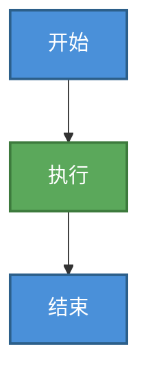

# 文档写作工作流

## §1 最小模板

每份文档开头结构固定：先一级标题，再引用块。

```markdown
# 文档标题（中文，与文件名语义一致）

> **文档职责**：[这份文档覆盖什么内容，一句话]
> **适用场景**：[什么时候翻这份文档，一句话]
> **目标读者**：[谁在读，知识背景是什么]
> **维护规范**：[谁改了什么要同步更新哪里，禁止写空话]
```

规则：
- `#` 标题必须在最前
- `维护规范` 必须具体
- 新建 Markdown 文档时，文件名不使用空格；需要分隔语义时优先使用下划线 `_`

## §2 工作流

新建文档时：

1. 先确定文档职责和边界
2. 套用 §1 模板，再规划 2 到 4 个 `##` 主模块
3. 填充内容时遵循 `rules/writing.md`

Review 文档时：

1. 先检查开头模板是否完整
2. 再检查结构和命名
3. 最后按 `rules/writing.md` 复核表达质量

## §3 最小检查点

- 开头是否完整：标题 + 职责 / 场景 / 读者 / 维护规范
- 结构是否清楚：层级不过深，同层不重叠
- 表达是否合格：对照 `rules/writing.md` 检查
- 图示是否合适：对照 §4 Mermaid 配色规范检查

## §4 Mermaid 配色最佳实践

### 基本原则

使用 `classDef` 定义语义化配色类，深色背景配白色文字，确保对比度和可读性。

### 标准配色模板

```markdown
classDef 类名 fill:#背景色,stroke:#边框色,stroke-width:2px,color:#fff
```

### 推荐配色方案

```mermaid
classDef planning fill:#4A90D9,stroke:#2C5F8A,stroke-width:2px,color:#fff
classDef design fill:#7C6BAF,stroke:#5A4A8A,stroke-width:2px,color:#fff
classDef implementation fill:#5BA85B,stroke:#3D7A3D,stroke-width:2px,color:#fff
classDef verification fill:#E8A838,stroke:#B07820,stroke-width:2px,color:#fff
classDef governance fill:#D9534F,stroke:#A94442,stroke-width:2px,color:#fff
classDef control fill:#6B6B6B,stroke:#4A4A4A,stroke-width:2px,color:#fff
```

**语义化分类**：
- `planning`（蓝色）：规划、定义阶段
- `design`（紫色）：设计、架构阶段
- `implementation`（绿色）：实现、执行阶段
- `verification`（橙色）：验证、测试阶段
- `governance`（红色）：治理、收尾阶段
- `control`（灰色）：流程控制、起止节点

### 使用示例



### 检查要点

- ✓ 所有类定义放在图表开头
- ✓ 背景色和边框色对比明显
- ✓ 文字统一使用白色（`color:#fff`）
- ✓ 类名语义化，见名知意
- ✓ 边框宽度统一为 2px

## §5 适用场景

- 新建 Markdown 文档
- Review 文档格式和结构
- 需要统一文档模板时
- 绘制 Mermaid 流程图时
